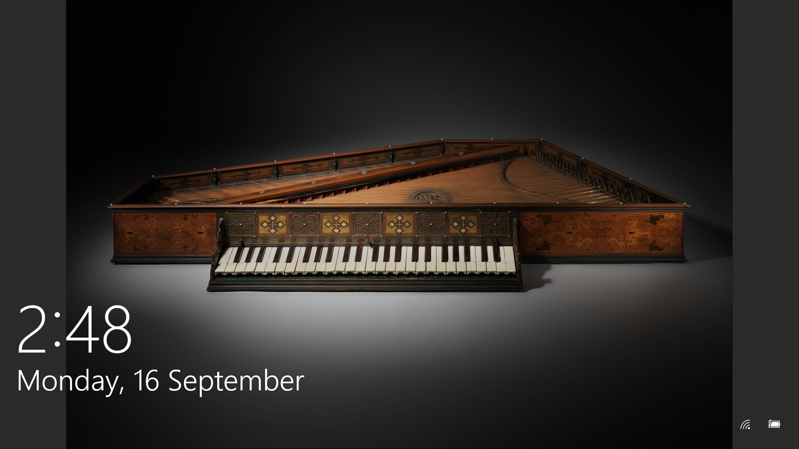
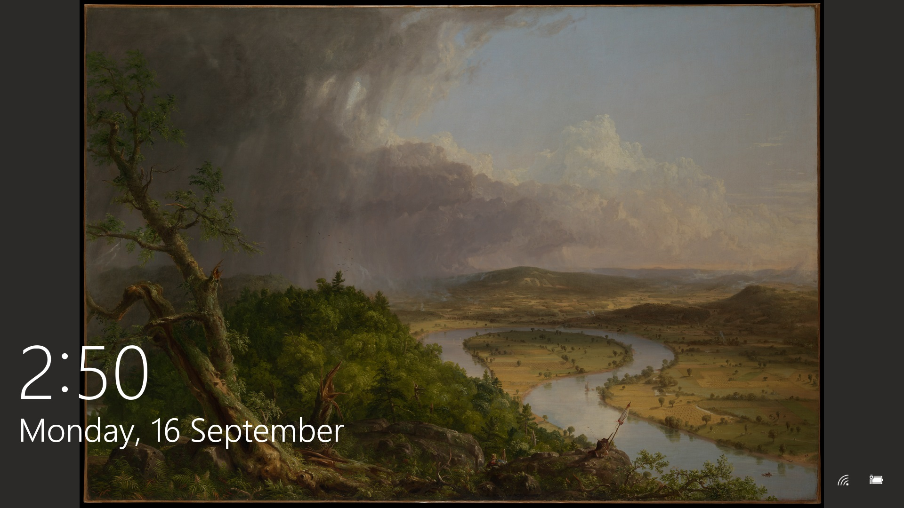

# wallpaper 

Application to update the Windows lockscreen from a curated list of works of art provided by the Metropolitan Museum of Art in New York. 

### Features
- [x] Fits image to screen resolution.
- [x] Image extraction script is optimized to be as fast as possible.
- [x] Logs locksreen updates. 
- [x] Provides information relevant to the piece of art.
- [x] Allows scheduling as per user's needs.
- [x] Easy setup.
- [ ] Pull images from Instagram.

### Installation
1. Run `pip3 install -r requirements.txt`
2. Right click on `schedule.bat` and select `Run as administrator`

Run `disable.bat` as an administrator to remove the task. 

API: https://collectionapi.metmuseum.org/public/collection/v1/
